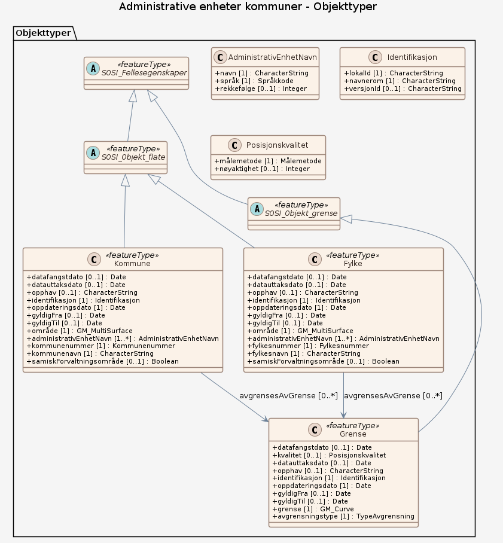

# Produktspesifikasjon: Administrative enheter kommuner

## Generelt om spesifikasjonen

### Unik identifisering

041f1e6e-bdbc-4091-b48f-8a5990f3cc5b

#### Fullstendig navn

Administrative enheter kommuner

#### Versjon

2006-07-01

### Referansedato

2025-12-10

### Ansvarlig organisasjon

Kartverket

### Språk

nor

### Hovedtema

Kommune, Administrativ inndeling, Administrative grenser, Kommunegrenser, Fylkesgrenser, Riksgrense, ABAS, Norge fastland, Administrative enheter, Det offentlige kartgrunnlaget, Inspire, geodataloven, Norge digitalt, beredskapsbase, dataNorgeNo, fellesDatakatalog, Basis geodata, Norge

### Temakategori

Administrative grenser

### Sammendrag

Datasettet viser kommuneinndelinga i landet med de mest nøyaktige grensene som er registrert digitalt og som er samlet i ett datasett. Datasettet har referansedato 1.1.2026, og er oppdatert med overføring av to arealer mellom Indre Østfold og Nordre Follo ved Slemmestadveien, og et areal mellom Indre Østfold og Vestby ved Laaskenveien. Det er i tillegg oppdatert med en del mindre kvalitetshevinger, som følge av jordskiftesaker og klarlegging av eksisterende grense på kommune-/fylkesgrenser.
 
Flatene inneholder egenskaper som forteller om offisielle kommunenumre. De offisielle norske, samiske og kvenske navnene for kommunene er hentet fra SSR. I tillegg finnes informasjon om samiske forvaltningsområder.

Geodataene er fra nasjonal inndelingsbase, som er en del av matrikkelen. Ved overgang til ny forvaltningsløsning, ble det også gjort endringer i UML-modellen.

### Formål

Framstille den offisielle kommuneinndelingen.

### Bruksområde

Forvaltningsmessig saksbehandling. Analyse og presentasjon i et GIS-system. Presentasjon av statistikk og analyser. Produksjon av kart og avledede produkter. Saksbehandling på lokalt og regionalt plan etter plan- og bygningsloven.

### Romlig representasjonstype

Vektor

### Romlig oppløsning

**Ekvivalent målestokk**: 5000

### Utstrekning

**Geografisk utstrekning**:

- **Vest**: 2.0
- **Øst**: 33.0
- **Sør**: 57.0
- **Nord**: 72.0

**Tidsmessig utstrekning**:

- **Tidsperiode**:
  - **Fra**: 2006-07-01
  - **Til**: 2025-12-10

### Tilleggsinformasjon

Trenger du hjelp til å laste ned og ta i bruk Kartverkets data og tjenester? På kartverket.no finner du tips og veiledning.

### Begrensninger

**Ressursbegrensninger**:

- **Bruksbegrensninger**: Ingen begrensninger på bruk er oppgitt. Se forøvrig lisens.

**Juridiske begrensninger**:

- **Tilgangsbegrensninger**: Åpne data
- **Bruksbegrensninger**: Lisens
- **Lisens**: Creative Commons BY 4.0 (CC BY 4.0)
- **Lisenslenke**: <https://creativecommons.org/licenses/by/4.0/>

**Sikkerhetsbegrensninger**:

- **Klassifisering**: Ugradert

## Spesifikasjonsomfang

- **Omfang**:

  - **Identifikasjon**: hele datasettet
  - **Nivå**: dataset
  - **Utstrekning**: - **Beskrivelse**: National

## Innhold og struktur

**Beskrivelse**: Forvaltningsmessig saksbehandling. Analyse og presentasjon i et GIS-system. Presentasjon av statistikk og analyser. Produksjon av kart og avledede produkter. Saksbehandling på lokalt og regionalt plan etter plan- og bygningsloven.

### Datamodell

#### Kommune

inndeling i administrative og politiske enheter innenfor fylket  Merknad: Tilsvarer NUTS 5 og LAU 2 på internasjonalt statistisk nivå

Egenskaper

<table class="feature-attribute-table">
  <colgroup>
    <col style="width: 35%;" />
    <col style="width: 65%;" />
  </colgroup>
  <tbody>
    <tr>
      <th scope="row">Navn:</th>
      <td><strong>område</strong></td>
    </tr>
    <tr>
      <th scope="row">Definisjon:</th>
      <td>den geografiske avgrensingen av stemmekretsen.</td>
    </tr>
    <tr>
      <th scope="row">Multiplisitet:</th>
      <td>1</td>
    </tr>
    <tr>
      <th scope="row">Type:</th>
      <td>GM_MultiSurface</td>
    </tr>
  </tbody>
</table>

<table class="feature-attribute-table">
  <colgroup>
    <col style="width: 35%;" />
    <col style="width: 65%;" />
  </colgroup>
  <tbody>
    <tr>
      <th scope="row">Navn:</th>
      <td><strong>administrativEnhetNavn</strong></td>
    </tr>
    <tr>
      <th scope="row">Definisjon:</th>
      <td>offisielt navn på en kommune, et fylke eller en nasjon</td>
    </tr>
    <tr>
      <th scope="row">Multiplisitet:</th>
      <td>1..*</td>
    </tr>
    <tr>
      <th scope="row">Type:</th>
      <td>AdministrativEnhetNavn</td>
    </tr>
  </tbody>
</table>

<table class="feature-attribute-table">
  <colgroup>
    <col style="width: 35%;" />
    <col style="width: 65%;" />
  </colgroup>
  <tbody>
    <tr>
      <th scope="row">Navn:</th>
      <td><strong>administrativEnhetNavn.navn</strong></td>
    </tr>
    <tr>
      <th scope="row">Definisjon:</th>
      <td>navnet på den administrative enheten i angitt språk.</td>
    </tr>
    <tr>
      <th scope="row">Multiplisitet:</th>
      <td>1</td>
    </tr>
    <tr>
      <th scope="row">Type:</th>
      <td>CharacterString</td>
    </tr>
  </tbody>
</table>

<table class="feature-attribute-table">
  <colgroup>
    <col style="width: 35%;" />
    <col style="width: 65%;" />
  </colgroup>
  <tbody>
    <tr>
      <th scope="row">Navn:</th>
      <td><strong>administrativEnhetNavn.språk</strong></td>
    </tr>
    <tr>
      <th scope="row">Definisjon:</th>
      <td>angir språk for det administrative navnet.</td>
    </tr>
    <tr>
      <th scope="row">Multiplisitet:</th>
      <td>1</td>
    </tr>
    <tr>
      <th scope="row">Type:</th>
      <td>Språkkode</td>
    </tr>
    <tr>
      <th scope="row">Tillatte verdier:</th>
      <td>- English - KvenFinnish – Kven Finnish - LuleSami – Lule Sami - NorthernSami – Northern Sami - Swedish - Finnish - Norwegian - SouthernSami – Southern Sami</td>
    </tr>
  </tbody>
</table>

<table class="feature-attribute-table">
  <colgroup>
    <col style="width: 35%;" />
    <col style="width: 65%;" />
  </colgroup>
  <tbody>
    <tr>
      <th scope="row">Navn:</th>
      <td><strong>administrativEnhetNavn.rekkefølge</strong></td>
    </tr>
    <tr>
      <th scope="row">Definisjon:</th>
      <td>angir presentasjonsrekkefølge i sammenstaninger av nav på administretiv enhet ved presentasjon på alle sprøkformer.</td>
    </tr>
    <tr>
      <th scope="row">Multiplisitet:</th>
      <td>0..1</td>
    </tr>
    <tr>
      <th scope="row">Type:</th>
      <td>Integer</td>
    </tr>
  </tbody>
</table>

<table class="feature-attribute-table">
  <colgroup>
    <col style="width: 35%;" />
    <col style="width: 65%;" />
  </colgroup>
  <tbody>
    <tr>
      <th scope="row">Navn:</th>
      <td><strong>kommunenummer</strong></td>
    </tr>
    <tr>
      <th scope="row">Definisjon:</th>
      <td>nummerering av kommunen i henhold til Statistisk sentralbyrå sin offisielle liste  Merknad: Det presiseres at kommune alltid skal ha 4 siffer, dvs. eventuelt med ledende null. Kommune benyttes for kopling mot en rekke andre registre som også benytter 4 siffer.</td>
    </tr>
    <tr>
      <th scope="row">Multiplisitet:</th>
      <td>1</td>
    </tr>
    <tr>
      <th scope="row">Type:</th>
      <td>Kommunenummer</td>
    </tr>
    <tr>
      <th scope="row">Tillatte verdier:</th>
      <td>- Kodeliste: <a href="https://register.geonorge.no/sosi-kodelister/inndelinger/inndelingsbase/kommunenummer">https://register.geonorge.no/sosi-kodelister/inndelinger/inndelingsbase/kommunenummer</a></td>
    </tr>
  </tbody>
</table>

<table class="feature-attribute-table">
  <colgroup>
    <col style="width: 35%;" />
    <col style="width: 65%;" />
  </colgroup>
  <tbody>
    <tr>
      <th scope="row">Navn:</th>
      <td><strong>kommunenavn</strong></td>
    </tr>
    <tr>
      <th scope="row">Definisjon:</th>
      <td>Offisielt navn på en kommune. Merk: Hvis kommunen har flere vedtatte parallellnavn, framstår disse i en sammenhengende tekststreng.</td>
    </tr>
    <tr>
      <th scope="row">Multiplisitet:</th>
      <td>1</td>
    </tr>
    <tr>
      <th scope="row">Type:</th>
      <td>CharacterString</td>
    </tr>
  </tbody>
</table>

<table class="feature-attribute-table">
  <colgroup>
    <col style="width: 35%;" />
    <col style="width: 65%;" />
  </colgroup>
  <tbody>
    <tr>
      <th scope="row">Navn:</th>
      <td><strong>samiskForvaltningsområde</strong></td>
    </tr>
    <tr>
      <th scope="row">Definisjon:</th>
      <td>angir om kommunen er en del ac samisk forvaltningaområde</td>
    </tr>
    <tr>
      <th scope="row">Multiplisitet:</th>
      <td>0..1</td>
    </tr>
    <tr>
      <th scope="row">Type:</th>
      <td>Boolean</td>
    </tr>
  </tbody>
</table>

Relasjoner

**Arv**
SOSI_Objekt_flate

**Assosiasjoner**
Grense – rolle: avgrensesAvGrense – kardinalitet: 0..*

#### SOSI_Objekt_flate (abstrakt)

abstrakt objekttype som bærer en rekke egenskaper som er fagområde-uavhengige og kan benyttes for alle objekttyper  Merknad: Spesielt i produktspesifikasjonsarbeid vil en velge egenskaper og avgrensningslinjer fra denne klassen.

Egenskaper

<table class="feature-attribute-table">
  <colgroup>
    <col style="width: 35%;" />
    <col style="width: 65%;" />
  </colgroup>
  <tbody>
    <tr>
      <th scope="row">Navn:</th>
      <td><strong>datafangstdato</strong></td>
    </tr>
    <tr>
      <th scope="row">Definisjon:</th>
      <td>dato når objektet siste gang ble registrert/observert/målt i terrenget  Merknad: I mange tilfeller er denne forskjellig fra oppdateringsdato, da registrerte endringer kan bufres i en kortere eller lengre periode før disse legges inn i databasen. Ved førstegangsregistrering settes Datafangstdato lik førsteDatafangstdato.</td>
    </tr>
    <tr>
      <th scope="row">Multiplisitet:</th>
      <td>0..1</td>
    </tr>
    <tr>
      <th scope="row">Type:</th>
      <td>DateTime</td>
    </tr>
  </tbody>
</table>

<table class="feature-attribute-table">
  <colgroup>
    <col style="width: 35%;" />
    <col style="width: 65%;" />
  </colgroup>
  <tbody>
    <tr>
      <th scope="row">Navn:</th>
      <td><strong>datauttaksdato</strong></td>
    </tr>
    <tr>
      <th scope="row">Definisjon:</th>
      <td>dato for uttak fra en database  Merknad: Skiller seg fra Kopidato ved at en ikke skiller på om det er uttak fra en originaldatabase eller en kopidatabase.</td>
    </tr>
    <tr>
      <th scope="row">Multiplisitet:</th>
      <td>0..1</td>
    </tr>
    <tr>
      <th scope="row">Type:</th>
      <td>DateTime</td>
    </tr>
  </tbody>
</table>

<table class="feature-attribute-table">
  <colgroup>
    <col style="width: 35%;" />
    <col style="width: 65%;" />
  </colgroup>
  <tbody>
    <tr>
      <th scope="row">Navn:</th>
      <td><strong>opphav</strong></td>
    </tr>
    <tr>
      <th scope="row">Definisjon:</th>
      <td>referanse til opphavsmaterialet, kildematerialet, organisasjons/publiseringskilde  Merknad: Kan også beskrive navn på person og årsak til oppdatering</td>
    </tr>
    <tr>
      <th scope="row">Multiplisitet:</th>
      <td>0..1</td>
    </tr>
    <tr>
      <th scope="row">Type:</th>
      <td>CharacterString</td>
    </tr>
  </tbody>
</table>

Relasjoner

**Arv**
SOSI_Fellesegenskaper

#### Grense

Generell avgrensingslinje

Egenskaper

<table class="feature-attribute-table">
  <colgroup>
    <col style="width: 35%;" />
    <col style="width: 65%;" />
  </colgroup>
  <tbody>
    <tr>
      <th scope="row">Navn:</th>
      <td><strong>grense</strong></td>
    </tr>
    <tr>
      <th scope="row">Definisjon:</th>
      <td>Geometri for avgrensingslinjer</td>
    </tr>
    <tr>
      <th scope="row">Multiplisitet:</th>
      <td>1</td>
    </tr>
    <tr>
      <th scope="row">Type:</th>
      <td>GM_Curve</td>
    </tr>
  </tbody>
</table>

<table class="feature-attribute-table">
  <colgroup>
    <col style="width: 35%;" />
    <col style="width: 65%;" />
  </colgroup>
  <tbody>
    <tr>
      <th scope="row">Navn:</th>
      <td><strong>avgrensningstype</strong></td>
    </tr>
    <tr>
      <th scope="row">Definisjon:</th>
      <td>angir type avgreisningslinje. Ulike objekter avgrenses av ulike typer grenser.</td>
    </tr>
    <tr>
      <th scope="row">Multiplisitet:</th>
      <td>1</td>
    </tr>
    <tr>
      <th scope="row">Type:</th>
      <td>TypeAvgrensning</td>
    </tr>
    <tr>
      <th scope="row">Tillatte verdier:</th>
      <td>- Riksgrense – avgrensningen av nasjonen Norge på land mot andre nasjoner - Territorialgrense – avgrensning i havet av statens suverenitetsområde, beregnet 12 nm (22 224 m) utenfor og parallelt med grunnlinjen - AvtaltAvgrensningslinje – avtalt avgrensningslinje til havs basert på folkerettslig bindende avtaler

Merknad:
Avtalt avgrensningslinje vil normalt gjelde alle aktuelle former for kyststatsjurisdiksjon. Detaljene vil framgå av den aktuelle avgrensningsavtale.

Merknad 2:
Benyttes også som avgrensning av kontinentalsokkel i internasjonalt farvann, der flere stater kan framlegge dokumentasjon om rettigheter til sokkelen, men der statene har kommet til enighet om en avgrensningslinje. - Kommunegrense – avgrensing av kommune - Fylkesgrense – avgrensning av fylke - Grunnkretsgrense – avgrensning av grunnkrets - Delområdegrense – avgrensning av delområde - Stemmekretsgrense – avgrensing av Stemmekrets</td>
    </tr>
  </tbody>
</table>

Relasjoner

**Arv**
SOSI_Objekt_grense

#### SOSI_Fellesegenskaper (abstrakt)

abstrakt objekttype som bærer sentrale egenskaper som er anbefalt for bruk i produktspesifikasjoner.  Merknad: Disse egenskapene skal derfor ikke modelleres inn i fagområdemodeller.

Egenskaper

<table class="feature-attribute-table">
  <colgroup>
    <col style="width: 35%;" />
    <col style="width: 65%;" />
  </colgroup>
  <tbody>
    <tr>
      <th scope="row">Navn:</th>
      <td><strong>identifikasjon</strong></td>
    </tr>
    <tr>
      <th scope="row">Definisjon:</th>
      <td>unik identifikasjon av et objekt</td>
    </tr>
    <tr>
      <th scope="row">Multiplisitet:</th>
      <td>1</td>
    </tr>
    <tr>
      <th scope="row">Type:</th>
      <td>Identifikasjon</td>
    </tr>
  </tbody>
</table>

<table class="feature-attribute-table">
  <colgroup>
    <col style="width: 35%;" />
    <col style="width: 65%;" />
  </colgroup>
  <tbody>
    <tr>
      <th scope="row">Navn:</th>
      <td><strong>identifikasjon.lokalId</strong></td>
    </tr>
    <tr>
      <th scope="row">Definisjon:</th>
      <td>lokal identifikator av et objekt  Merknad: Det er dataleverandørens ansvar å sørge for at den lokale identifikatoren er unik innenfor navnerommet.</td>
    </tr>
    <tr>
      <th scope="row">Multiplisitet:</th>
      <td>1</td>
    </tr>
    <tr>
      <th scope="row">Type:</th>
      <td>CharacterString</td>
    </tr>
  </tbody>
</table>

<table class="feature-attribute-table">
  <colgroup>
    <col style="width: 35%;" />
    <col style="width: 65%;" />
  </colgroup>
  <tbody>
    <tr>
      <th scope="row">Navn:</th>
      <td><strong>identifikasjon.navnerom</strong></td>
    </tr>
    <tr>
      <th scope="row">Definisjon:</th>
      <td>navnerom som unikt identifiserer datakilden til et objekt, anbefales å være en http-URI  Eksempel: <a href="http://data.geonorge.no/SentraltStedsnavnsregister/1.0">http://data.geonorge.no/SentraltStedsnavnsregister/1.0</a>  Merknad : Verdien for navnerom vil eies av den dataprodusent som har ansvar for de unike identifikatorene og må være registrert i data.geonorge.no eller data.norge.no</td>
    </tr>
    <tr>
      <th scope="row">Multiplisitet:</th>
      <td>1</td>
    </tr>
    <tr>
      <th scope="row">Type:</th>
      <td>CharacterString</td>
    </tr>
  </tbody>
</table>

<table class="feature-attribute-table">
  <colgroup>
    <col style="width: 35%;" />
    <col style="width: 65%;" />
  </colgroup>
  <tbody>
    <tr>
      <th scope="row">Navn:</th>
      <td><strong>identifikasjon.versjonId</strong></td>
    </tr>
    <tr>
      <th scope="row">Definisjon:</th>
      <td>identifikasjon av en spesiell versjon av et geografisk objekt (instans)</td>
    </tr>
    <tr>
      <th scope="row">Multiplisitet:</th>
      <td>0..1</td>
    </tr>
    <tr>
      <th scope="row">Type:</th>
      <td>CharacterString</td>
    </tr>
  </tbody>
</table>

<table class="feature-attribute-table">
  <colgroup>
    <col style="width: 35%;" />
    <col style="width: 65%;" />
  </colgroup>
  <tbody>
    <tr>
      <th scope="row">Navn:</th>
      <td><strong>oppdateringsdato</strong></td>
    </tr>
    <tr>
      <th scope="row">Definisjon:</th>
      <td>tidspunkt for siste endring på objektet  Merknad: Oppdateringsdato kan være forskjellig fra datafangsdato ved at data som er registrert kan bufres en kortere eller lengre periode før disse legges inn i datasystemet (databasen).</td>
    </tr>
    <tr>
      <th scope="row">Multiplisitet:</th>
      <td>1</td>
    </tr>
    <tr>
      <th scope="row">Type:</th>
      <td>DateTime</td>
    </tr>
  </tbody>
</table>

<table class="feature-attribute-table">
  <colgroup>
    <col style="width: 35%;" />
    <col style="width: 65%;" />
  </colgroup>
  <tbody>
    <tr>
      <th scope="row">Navn:</th>
      <td><strong>gyldigFra</strong></td>
    </tr>
    <tr>
      <th scope="row">Definisjon:</th>
      <td>Tidspunktet når objektet oppstod i den virkelige verden</td>
    </tr>
    <tr>
      <th scope="row">Multiplisitet:</th>
      <td>0..1</td>
    </tr>
    <tr>
      <th scope="row">Type:</th>
      <td>Date</td>
    </tr>
  </tbody>
</table>

<table class="feature-attribute-table">
  <colgroup>
    <col style="width: 35%;" />
    <col style="width: 65%;" />
  </colgroup>
  <tbody>
    <tr>
      <th scope="row">Navn:</th>
      <td><strong>gyldigTil</strong></td>
    </tr>
    <tr>
      <th scope="row">Definisjon:</th>
      <td>Tidspunktet når objektet opphørte å eksistere i den virkelige verden</td>
    </tr>
    <tr>
      <th scope="row">Multiplisitet:</th>
      <td>0..1</td>
    </tr>
    <tr>
      <th scope="row">Type:</th>
      <td>Date</td>
    </tr>
  </tbody>
</table>

#### SOSI_Objekt_grense (abstrakt)

abstrakt objekttype som bærer en rekke egenskaper som er fagområde-uavhengige og kan benyttes for alle objekttyper  Merknad: Spesielt i produktspesifikasjonsarbeid vil en velge egenskaper og avgrensningslinjer fra denne klassen.

Egenskaper

<table class="feature-attribute-table">
  <colgroup>
    <col style="width: 35%;" />
    <col style="width: 65%;" />
  </colgroup>
  <tbody>
    <tr>
      <th scope="row">Navn:</th>
      <td><strong>datafangstdato</strong></td>
    </tr>
    <tr>
      <th scope="row">Definisjon:</th>
      <td>dato når objektet siste gang ble registrert/observert/målt i terrenget  Merknad: I mange tilfeller er denne forskjellig fra oppdateringsdato, da registrerte endringer kan bufres i en kortere eller lengre periode før disse legges inn i databasen. Ved førstegangsregistrering settes Datafangstdato lik førsteDatafangstdato.</td>
    </tr>
    <tr>
      <th scope="row">Multiplisitet:</th>
      <td>0..1</td>
    </tr>
    <tr>
      <th scope="row">Type:</th>
      <td>DateTime</td>
    </tr>
  </tbody>
</table>

<table class="feature-attribute-table">
  <colgroup>
    <col style="width: 35%;" />
    <col style="width: 65%;" />
  </colgroup>
  <tbody>
    <tr>
      <th scope="row">Navn:</th>
      <td><strong>kvalitet</strong></td>
    </tr>
    <tr>
      <th scope="row">Definisjon:</th>
      <td>beskrivelse av kvaliteten på stedfestingen</td>
    </tr>
    <tr>
      <th scope="row">Multiplisitet:</th>
      <td>0..1</td>
    </tr>
    <tr>
      <th scope="row">Type:</th>
      <td>Posisjonskvalitet</td>
    </tr>
  </tbody>
</table>

<table class="feature-attribute-table">
  <colgroup>
    <col style="width: 35%;" />
    <col style="width: 65%;" />
  </colgroup>
  <tbody>
    <tr>
      <th scope="row">Navn:</th>
      <td><strong>kvalitet.målemetode</strong></td>
    </tr>
    <tr>
      <th scope="row">Definisjon:</th>
      <td>metode for måling i grunnriss (x,y), og høyde (z) når metoden er den samme som ved måling i grunnriss</td>
    </tr>
    <tr>
      <th scope="row">Multiplisitet:</th>
      <td>1</td>
    </tr>
    <tr>
      <th scope="row">Type:</th>
      <td>Målemetode</td>
    </tr>
    <tr>
      <th scope="row">Tillatte verdier:</th>
      <td>- Kodeliste: <a href="https://register.geonorge.no/sosi-kodelister/generelle-konsepter/4.5/m%C3%A5lemetodekode">https://register.geonorge.no/sosi-kodelister/generelle-konsepter/4.5/m%C3%A5lemetodekode</a></td>
    </tr>
  </tbody>
</table>

<table class="feature-attribute-table">
  <colgroup>
    <col style="width: 35%;" />
    <col style="width: 65%;" />
  </colgroup>
  <tbody>
    <tr>
      <th scope="row">Navn:</th>
      <td><strong>kvalitet.nøyaktighet</strong></td>
    </tr>
    <tr>
      <th scope="row">Definisjon:</th>
      <td>punktstandardavviket i grunnriss for punkter samt tverravvik for linjer  Merknad: Oppgitt i cm</td>
    </tr>
    <tr>
      <th scope="row">Multiplisitet:</th>
      <td>0..1</td>
    </tr>
    <tr>
      <th scope="row">Type:</th>
      <td>Integer</td>
    </tr>
  </tbody>
</table>

<table class="feature-attribute-table">
  <colgroup>
    <col style="width: 35%;" />
    <col style="width: 65%;" />
  </colgroup>
  <tbody>
    <tr>
      <th scope="row">Navn:</th>
      <td><strong>datauttaksdato</strong></td>
    </tr>
    <tr>
      <th scope="row">Definisjon:</th>
      <td>dato for uttak fra en database  Merknad: Skiller seg fra Kopidato ved at en ikke skiller på om det er uttak fra en originaldatabase eller en kopidatabase.</td>
    </tr>
    <tr>
      <th scope="row">Multiplisitet:</th>
      <td>0..1</td>
    </tr>
    <tr>
      <th scope="row">Type:</th>
      <td>DateTime</td>
    </tr>
  </tbody>
</table>

<table class="feature-attribute-table">
  <colgroup>
    <col style="width: 35%;" />
    <col style="width: 65%;" />
  </colgroup>
  <tbody>
    <tr>
      <th scope="row">Navn:</th>
      <td><strong>opphav</strong></td>
    </tr>
    <tr>
      <th scope="row">Definisjon:</th>
      <td>referanse til opphavsmaterialet, kildematerialet, organisasjons/publiseringskilde  Merknad: Kan også beskrive navn på person og årsak til oppdatering</td>
    </tr>
    <tr>
      <th scope="row">Multiplisitet:</th>
      <td>0..1</td>
    </tr>
    <tr>
      <th scope="row">Type:</th>
      <td>CharacterString</td>
    </tr>
  </tbody>
</table>

Relasjoner

**Arv**
SOSI_Fellesegenskaper

#### Fylke

administrativ inndeling av nasjonen på regionalt nivå  Merknad: Tilsvarer NUTS 3 på internasjonalt statistisk nivå

Egenskaper

<table class="feature-attribute-table">
  <colgroup>
    <col style="width: 35%;" />
    <col style="width: 65%;" />
  </colgroup>
  <tbody>
    <tr>
      <th scope="row">Navn:</th>
      <td><strong>område</strong></td>
    </tr>
    <tr>
      <th scope="row">Definisjon:</th>
      <td>den geografiske avgrensingen av stemmekretsen.</td>
    </tr>
    <tr>
      <th scope="row">Multiplisitet:</th>
      <td>1</td>
    </tr>
    <tr>
      <th scope="row">Type:</th>
      <td>GM_MultiSurface</td>
    </tr>
  </tbody>
</table>

<table class="feature-attribute-table">
  <colgroup>
    <col style="width: 35%;" />
    <col style="width: 65%;" />
  </colgroup>
  <tbody>
    <tr>
      <th scope="row">Navn:</th>
      <td><strong>administrativEnhetNavn</strong></td>
    </tr>
    <tr>
      <th scope="row">Definisjon:</th>
      <td>offisielt navn på en kommune, et fylke eller en nasjon</td>
    </tr>
    <tr>
      <th scope="row">Multiplisitet:</th>
      <td>1..*</td>
    </tr>
    <tr>
      <th scope="row">Type:</th>
      <td>AdministrativEnhetNavn</td>
    </tr>
  </tbody>
</table>

<table class="feature-attribute-table">
  <colgroup>
    <col style="width: 35%;" />
    <col style="width: 65%;" />
  </colgroup>
  <tbody>
    <tr>
      <th scope="row">Navn:</th>
      <td><strong>administrativEnhetNavn.navn</strong></td>
    </tr>
    <tr>
      <th scope="row">Definisjon:</th>
      <td>navnet på den administrative enheten i angitt språk.</td>
    </tr>
    <tr>
      <th scope="row">Multiplisitet:</th>
      <td>1</td>
    </tr>
    <tr>
      <th scope="row">Type:</th>
      <td>CharacterString</td>
    </tr>
  </tbody>
</table>

<table class="feature-attribute-table">
  <colgroup>
    <col style="width: 35%;" />
    <col style="width: 65%;" />
  </colgroup>
  <tbody>
    <tr>
      <th scope="row">Navn:</th>
      <td><strong>administrativEnhetNavn.språk</strong></td>
    </tr>
    <tr>
      <th scope="row">Definisjon:</th>
      <td>angir språk for det administrative navnet.</td>
    </tr>
    <tr>
      <th scope="row">Multiplisitet:</th>
      <td>1</td>
    </tr>
    <tr>
      <th scope="row">Type:</th>
      <td>Språkkode</td>
    </tr>
    <tr>
      <th scope="row">Tillatte verdier:</th>
      <td>- English - KvenFinnish – Kven Finnish - LuleSami – Lule Sami - NorthernSami – Northern Sami - Swedish - Finnish - Norwegian - SouthernSami – Southern Sami</td>
    </tr>
  </tbody>
</table>

<table class="feature-attribute-table">
  <colgroup>
    <col style="width: 35%;" />
    <col style="width: 65%;" />
  </colgroup>
  <tbody>
    <tr>
      <th scope="row">Navn:</th>
      <td><strong>administrativEnhetNavn.rekkefølge</strong></td>
    </tr>
    <tr>
      <th scope="row">Definisjon:</th>
      <td>angir presentasjonsrekkefølge i sammenstaninger av nav på administretiv enhet ved presentasjon på alle sprøkformer.</td>
    </tr>
    <tr>
      <th scope="row">Multiplisitet:</th>
      <td>0..1</td>
    </tr>
    <tr>
      <th scope="row">Type:</th>
      <td>Integer</td>
    </tr>
  </tbody>
</table>

<table class="feature-attribute-table">
  <colgroup>
    <col style="width: 35%;" />
    <col style="width: 65%;" />
  </colgroup>
  <tbody>
    <tr>
      <th scope="row">Navn:</th>
      <td><strong>fylkesnummer</strong></td>
    </tr>
    <tr>
      <th scope="row">Definisjon:</th>
      <td>nummerering av fylker i henhold til Statistisk sentralbyrå sin offisielle liste  Merknad: Det presiseres at fylkesnummer alltid skal ha 2 sifre, dvs. eventuelt med ledende null. Fylkesnummer benyttes for kopling mot en rekke andre registre som også benytter 2 sifre.</td>
    </tr>
    <tr>
      <th scope="row">Multiplisitet:</th>
      <td>1</td>
    </tr>
    <tr>
      <th scope="row">Type:</th>
      <td>Fylkesnummer</td>
    </tr>
    <tr>
      <th scope="row">Tillatte verdier:</th>
      <td>- Kodeliste: <a href="https://register.geonorge.no/sosi-kodelister/inndelinger/inndelingsbase/fylkesnummer">https://register.geonorge.no/sosi-kodelister/inndelinger/inndelingsbase/fylkesnummer</a>?</td>
    </tr>
  </tbody>
</table>

<table class="feature-attribute-table">
  <colgroup>
    <col style="width: 35%;" />
    <col style="width: 65%;" />
  </colgroup>
  <tbody>
    <tr>
      <th scope="row">Navn:</th>
      <td><strong>fylkesnavn</strong></td>
    </tr>
    <tr>
      <th scope="row">Definisjon:</th>
      <td>Offisielt navn på et fylke. Merk: Hvis fylket har flere vedtatte parallellnavn, framstår disse i en sammenhengende tekststreng.</td>
    </tr>
    <tr>
      <th scope="row">Multiplisitet:</th>
      <td>1</td>
    </tr>
    <tr>
      <th scope="row">Type:</th>
      <td>CharacterString</td>
    </tr>
  </tbody>
</table>

<table class="feature-attribute-table">
  <colgroup>
    <col style="width: 35%;" />
    <col style="width: 65%;" />
  </colgroup>
  <tbody>
    <tr>
      <th scope="row">Navn:</th>
      <td><strong>samiskForvaltningsområde</strong></td>
    </tr>
    <tr>
      <th scope="row">Definisjon:</th>
      <td>angir om fylket er en del ac samisk forvaltningaområde</td>
    </tr>
    <tr>
      <th scope="row">Multiplisitet:</th>
      <td>0..1</td>
    </tr>
    <tr>
      <th scope="row">Type:</th>
      <td>Boolean</td>
    </tr>
  </tbody>
</table>

Relasjoner

**Arv**
SOSI_Objekt_flate

**Assosiasjoner**
Grense – rolle: avgrensesAvGrense – kardinalitet: 0..*

### Kodelister

#### «Enumeration» Språkkode

**Definisjon:** ISO 639 del 3 språkkodetabell

Merknad: ufullstendig kodeliste pga. importfeil

language code tables of ISO 639 part 3

ISO 639-3 is a code that aims to define three-letter identifiers for all known human languages. At the core of ISO 639-3 are the individual languages already accounted for in ISO 639-2.

Koder

<table class="code-list-table">
  <thead>
    <tr>
      <th>Kodenavn:</th>
      <th>Definisjon:</th>
      <th>Kodeverdi:</th>
    </tr>
  </thead>
  <tbody>
    <tr>
      <td>English</td>
      <td></td>
      <td></td>
    </tr>
    <tr>
      <td>KvenFinnish</td>
      <td>Kven Finnish</td>
      <td></td>
    </tr>
    <tr>
      <td>LuleSami</td>
      <td>Lule Sami</td>
      <td></td>
    </tr>
    <tr>
      <td>NorthernSami</td>
      <td>Northern Sami</td>
      <td></td>
    </tr>
    <tr>
      <td>Swedish</td>
      <td></td>
      <td></td>
    </tr>
    <tr>
      <td>Finnish</td>
      <td></td>
      <td></td>
    </tr>
    <tr>
      <td>Norwegian</td>
      <td></td>
      <td></td>
    </tr>
    <tr>
      <td>SouthernSami</td>
      <td>Southern Sami</td>
      <td></td>
    </tr>
  </tbody>
</table>

#### «CodeList» Kommunenummer

**Definisjon:** &lt;font color="#333333"&gt;nummerering av kommuner i henhold til SSB sin offisielle liste&lt;/font&gt;
Merknad: &lt;font color="#333333"&gt;Inneholder fremtidige, gyldige og utgåtte kommunenummer. &lt;/font&gt;Det presiseres at kommune alltid skal ha 4 sifre, dvs. eventuelt med ledende null. Kommune benyttes for kopling mot en rekke andre registre som også benytter 4 sifre.

&lt;i&gt;URI til ekstern kodeliste:&lt;/i&gt; <a href="https://register.geonorge.no/sosi-kodelister/kommunenummer?page=2"><https://register.geonorge.no/sosi-kodelister/kommunenummer?page=2></a>

Profilparametre i tagged values

<table class="feature-attribute-table">
  <colgroup>
    <col style="width: 35%;" />
    <col style="width: 65%;" />
  </colgroup>
  <tbody>
    <tr>
      <th scope="row">asDictionary</th>
      <td>true</td>
    </tr>
    <tr>
      <th scope="row">codeList</th>
      <td><a href="https://register.geonorge.no/sosi-kodelister/inndelinger/inndelingsbase/kommunenummer">https://register.geonorge.no/sosi-kodelister/inndelinger/inndelingsbase/kommunenummer</a></td>
    </tr>
  </tbody>
</table>

#### «Enumeration» TypeAvgrensning

**Definisjon:** oversikt over ulike typer avgrensingslinjer.

Profilparametre i tagged values

<table class="feature-attribute-table">
  <colgroup>
    <col style="width: 35%;" />
    <col style="width: 65%;" />
  </colgroup>
  <tbody>
    <tr>
      <th scope="row">asDictionary</th>
      <td>false</td>
    </tr>
  </tbody>
</table>

Koder

<table class="code-list-table">
  <thead>
    <tr>
      <th>Kodenavn:</th>
      <th>Definisjon:</th>
      <th>Kodeverdi:</th>
    </tr>
  </thead>
  <tbody>
    <tr>
      <td>Riksgrense</td>
      <td>avgrensningen av nasjonen Norge på land mot andre nasjoner</td>
      <td></td>
    </tr>
    <tr>
      <td>Territorialgrense</td>
      <td>avgrensning i havet av statens suverenitetsområde, beregnet 12 nm (22 224 m) utenfor og parallelt med grunnlinjen</td>
      <td></td>
    </tr>
    <tr>
      <td>AvtaltAvgrensningslinje</td>
      <td>avtalt avgrensningslinje til havs basert på folkerettslig bindende avtaler

Merknad:
Avtalt avgrensningslinje vil normalt gjelde alle aktuelle former for kyststatsjurisdiksjon. Detaljene vil framgå av den aktuelle avgrensningsavtale.

Merknad 2:
Benyttes også som avgrensning av kontinentalsokkel i internasjonalt farvann, der flere stater kan framlegge dokumentasjon om rettigheter til sokkelen, men der statene har kommet til enighet om en avgrensningslinje.</td>
      <td></td>
    </tr>
    <tr>
      <td>Kommunegrense</td>
      <td>avgrensing av kommune</td>
      <td></td>
    </tr>
    <tr>
      <td>Fylkesgrense</td>
      <td>avgrensning av fylke</td>
      <td></td>
    </tr>
    <tr>
      <td>Grunnkretsgrense</td>
      <td>avgrensning av grunnkrets</td>
      <td></td>
    </tr>
    <tr>
      <td>Delområdegrense</td>
      <td>avgrensning av delområde</td>
      <td></td>
    </tr>
    <tr>
      <td>Stemmekretsgrense</td>
      <td>avgrensing av Stemmekrets</td>
      <td></td>
    </tr>
  </tbody>
</table>

#### «CodeList» Målemetode

**Definisjon:** metode som ligger til grunn for registrering av posisjon

-- Definition - -
method on which registration of position is based

Profilparametre i tagged values

<table class="feature-attribute-table">
  <colgroup>
    <col style="width: 35%;" />
    <col style="width: 65%;" />
  </colgroup>
  <tbody>
    <tr>
      <th scope="row">asDictionary</th>
      <td>true</td>
    </tr>
    <tr>
      <th scope="row">codeList</th>
      <td><a href="https://register.geonorge.no/sosi-kodelister/generelle-konsepter/4.5/m%C3%A5lemetodekode">https://register.geonorge.no/sosi-kodelister/generelle-konsepter/4.5/m%C3%A5lemetodekode</a></td>
    </tr>
  </tbody>
</table>

#### «CodeList» Fylkesnummer

**Definisjon:** nummerering av fylker &lt;font color="#333333"&gt; &lt;/font&gt;
&lt;font color="#333333"&gt;
&lt;/font&gt;&lt;font color="#333333"&gt;Merknad: Inneholder fremtidige, gyldige og utgåtte nummer. Fylket skal alltid ha 2 sifre, dvs. eventuelt med ledende null.&lt;/font&gt;
&lt;i&gt;URI til ekstern kodeliste:&lt;/i&gt; <a href="https://register.geonorge.no/sosi-kodelister/inndelinger/inndelingsbase/fylkesnummer"><https://register.geonorge.no/sosi-kodelister/inndelinger/inndelingsbase/fylkesnummer></a>

Profilparametre i tagged values

<table class="feature-attribute-table">
  <colgroup>
    <col style="width: 35%;" />
    <col style="width: 65%;" />
  </colgroup>
  <tbody>
    <tr>
      <th scope="row">asDictionary</th>
      <td>true</td>
    </tr>
    <tr>
      <th scope="row">codeList</th>
      <td><a href="https://register.geonorge.no/sosi-kodelister/inndelinger/inndelingsbase/fylkesnummer">https://register.geonorge.no/sosi-kodelister/inndelinger/inndelingsbase/fylkesnummer</a>?</td>
    </tr>
  </tbody>
</table>

## Referansesystem

**Romlige referansesystemer**:

- **kode**: EPSG:25832
  **navn**: EUREF89 UTM sone 32, 2d

- **kode**: EPSG:25833
  **navn**: EUREF89 UTM sone 33, 2d

- **kode**: EPSG:25835
  **navn**: EUREF89 UTM sone 35, 2d

- **kode**: EPSG:3035
  **navn**: EUREF89 / ETRS89-LAEA Europe

- **kode**: EPSG:4258
  **navn**: EUREF 89 Geografisk (ETRS 89) 2d

- **kode**: EPSG:25832
  **navn**: EUREF89 UTM sone 32, 2d

## Kvalitet

**Nivå**: dataset

- **Kvalitetsmål**: COMMISSION REGULATION (EU) No 1089/2010 of 23 November 2010 implementing Directive 2007/2/EC of the European Parliament and of the Council as regards interoperability of spatial data sets and services
  **Målebeskrivelse**: Dataene er i henhold til produktspesifikasjonen
  **Beskrivende resultat**: Dataene er i henhold til produktspesifikasjonen

- **Kvalitetsmål**: SOSI produktspesifikasjon: Administrative enheter Norge
  **Målebeskrivelse**: Dataene er i henhold til produktspesifikasjonen
  **Beskrivende resultat**: Dataene er i henhold til produktspesifikasjonen

- **Kvalitetsmål**: Sosi applikasjonsskjema
  **Målebeskrivelse**: SOSI-filer er i henhold til applikasjonsskjema
  **Beskrivende resultat**: SOSI-filer er i henhold til applikasjonsskjema

- **Kvalitetsmål**: Sosi applikasjonsskjema
  **Målebeskrivelse**: GML-filer er i henhold til applikasjonsskjema
  **Beskrivende resultat**: GML-filer er i henhold til applikasjonsskjema

- **Kvalitetsmål**: Prosentvis dekning i forhold til datasettets utstrekning
  **Målebeskrivelse**: Datasettets faktiske kartlagte areal i forhold til datasettets spesifiserte utstrekning
  **Resultat**: 100

- **Kvalitetsmål**: Prosentvis oppfyllelse av FAIR-prinsipper
  **Målebeskrivelse**: Angir fullstendighet i forhold til krav fra FAIR-prinsippene (The FAIR Guiding Principles for scientific data management and stewardship)
  **Resultat**: 97

- **Kvalitetsmål**: FAIR
  **Resultat**: Prosentvis oppfyllelse av FAIR-prinsipper: 97%

- **Kvalitetsmål**: Coverage
  **Resultat**: Prosentvis dekning i forhold til datasettets utstrekning: 100%

**Beskrivelse**: Trenger du hjelp til å laste ned og ta i bruk Kartverkets data og tjenester? På kartverket.no finner du tips og veiledning.

## Datavedlikehold

**Vedlikeholdsfrekvens**: Etter behov

**Status**: Kontinuerlig oppdatert

## Presentasjon

**navn**: Tegneregler

**Lenke**:
<https://register.geonorge.no/tegneregler/administrative-enheter-norge>

## Leveranse

- **Leveranse**:

  - **Leveransemedium**:
    - **unitsOfDelivery**: fylkesvis, kommunevis, landsfiler
    - **Medienavn**: Geonorge nedlastning
    - **Leveransetjeneste**:
      - **Tjenesteendepunkt**: <https://nedlasting.geonorge.no/api/capabilities/>
      - **Tjenesteegenskap**:
        - **type**: Geonorge nedlastning
        - **Verdi**: GEONORGE:DOWNLOAD
  - **Leveranseformat**:
    - **Formatnavn**: FGDB

    - **Formatnavn**: GeoJSON

    - **Formatnavn**: GML

    - **Formatnavn**: PostGIS

    - **Formatnavn**: SOSI

- **Leveranse**:

  - **Leveransemedium**:
    - **unitsOfDelivery**: fylkesvis, kommunevis, landsfiler
    - **Medienavn**: Atom Feed
    - **Leveransetjeneste**:
      - **Tjenesteendepunkt**: <http://nedlasting.geonorge.no/geonorge/ATOM-feeds/AdministrativeEnheterKommuner_AtomFeedFGDB.xml>
      - **Tjenesteegenskap**:
        - **type**: Atom Feed
        - **Verdi**: W3C:AtomFeed
  - **Leveranseformat**: - **Formatnavn**: FGDB

- **Leveranse**:

  - **Leveransemedium**:
    - **unitsOfDelivery**: fylkesvis, kommunevis, landsfiler
    - **Medienavn**: Atom Feed
    - **Leveransetjeneste**:
      - **Tjenesteendepunkt**: <http://nedlasting.geonorge.no/geonorge/ATOM-feeds/AdministrativeEnheterKommuner_AtomFeedGML.xml>
      - **Tjenesteegenskap**:
        - **type**: Atom Feed
        - **Verdi**: W3C:AtomFeed
  - **Leveranseformat**: - **Formatnavn**: GML

- **Leveranse**:

  - **Leveransemedium**:
    - **unitsOfDelivery**: fylkesvis, kommunevis, landsfiler
    - **Medienavn**: Atom Feed
    - **Leveransetjeneste**:
      - **Tjenesteendepunkt**: <http://nedlasting.geonorge.no/geonorge/ATOM-feeds/AdministrativeEnheterKommuner_AtomFeedGeoJSON.xml>
      - **Tjenesteegenskap**:
        - **type**: Atom Feed
        - **Verdi**: W3C:AtomFeed
  - **Leveranseformat**: - **Formatnavn**: GeoJSON

- **Leveranse**:

  - **Leveransemedium**:
    - **unitsOfDelivery**: fylkesvis, kommunevis, landsfiler
    - **Medienavn**: Atom Feed
    - **Leveransetjeneste**:
      - **Tjenesteendepunkt**: <http://nedlasting.geonorge.no/geonorge/ATOM-feeds/AdministrativeEnheterKommuner_AtomFeedPostGIS.xml>
      - **Tjenesteegenskap**:
        - **type**: Atom Feed
        - **Verdi**: W3C:AtomFeed
  - **Leveranseformat**: - **Formatnavn**: PostGIS

- **Leveranse**:

  - **Leveransemedium**:
    - **unitsOfDelivery**: fylkesvis, kommunevis, landsfiler
    - **Medienavn**: Atom Feed
    - **Leveransetjeneste**:
      - **Tjenesteendepunkt**: <http://nedlasting.geonorge.no/geonorge/ATOM-feeds/AdministrativeEnheterKommuner_AtomFeedSOSI.xml>
      - **Tjenesteegenskap**:
        - **type**: Atom Feed
        - **Verdi**: W3C:AtomFeed
  - **Leveranseformat**: - **Formatnavn**: SOSI

- **Leveranse**:

  - **Leveransemedium**:
    - **Medienavn**: Administrative enheter WMS
    - **Leveransetjeneste**:
      - **Tjenesteendepunkt**: <https://wms.geonorge.no/skwms1/wms.adm_enheter2?service=wms&request=GetCapabilities>
      - **Tjenesteegenskap**:
        - **type**: Administrative enheter WMS
        - **Verdi**: WMS-tjeneste
  - **Leveranseformat**: - **Formatnavn**: png
  - **Leveranseomfang**: Tjeneste

## Metadata

**Metadatastandard**: ISO19115

**Metadatastandardversjon**: 2003

**Metadatadato**: 2026-03-08

**språk**: nor

**Kontakt**:

- **Organisasjon**: Kartverket
- **Kontaktperson**: Liv Mari Nesje
- **Logo**: <https://register.geonorge.no/data/organizations/971040238_Kartverket_liten.png>
- **Epost**: post@kartverket.no
- **rolle**: pointOfContact

**Metadataidentifikator**:

- **Utsteder**: Geonorge
- **kode**: 041f1e6e-bdbc-4091-b48f-8a5990f3cc5b
- **koderom**: <https://kartkatalog.geonorge.no/metadata/>
- **Metadatalenke**: <https://kartkatalog.geonorge.no/metadata/041f1e6e-bdbc-4091-b48f-8a5990f3cc5b>

**Lenker**:

- **lenke**: <https://www.geonorge.no/geonetwork/srv/nor/csw?service=CSW&request=GetRecordById&version=2.0.2&outputSchema=http://www.isotc211.org/2005/gmd&elementSetName=full&id=041f1e6e-bdbc-4091-b48f-8a5990f3cc5b>
  **relasjon**: describedby
  **type**: application/xml
  **tittel**: Metadata (ISO 19139)

- **lenke**: <https://nedlasting.geonorge.no/api/capabilities/>
  **relasjon**: enclosure
  **type**: text/html
  **tittel**: Nedlasting

- **lenke**: #!?zoom=3&lon=306722&lat=7197864&wms=<https://wms.geonorge.no/skwms1/wms.adm_enheter2>
  **relasjon**: service
  **type**: text/html
  **tittel**: Tjeneste

- **lenke**: <https://wms.geonorge.no/skwms1/wms.adm_enheter2?service=wms&request=GetCapabilities>
  **relasjon**: service
  **type**: application/xml
  **tittel**: Tjeneste-distribusjon
